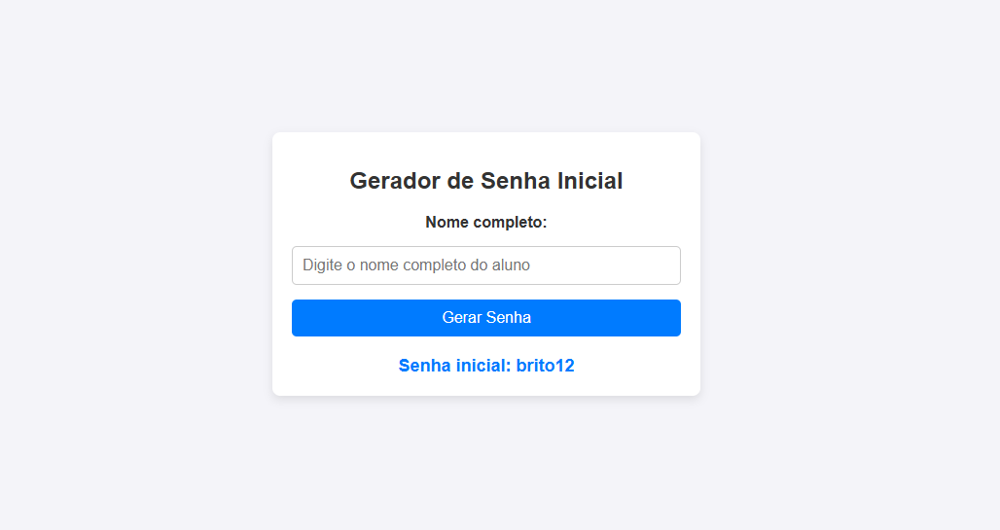

# Gerador de Senha Inicial para Alunos
Este projeto é uma aplicação web simples e responsiva que gera uma senha inicial para alunos com base no nome completo fornecido. Ele valida o nome, extrai o sobrenome em letras minúsculas e conta o número de vogais no nome para formar a senha.
## 🚀 Funcionalidades
- **Validação de nome completo:** Verifica se o nome possui pelo menos duas palavras.
- **Obtenção do sobrenome:** Extrai o último nome do aluno em letras minúsculas.
- **Contagem de vogais:** Conta o número de vogais no nome e formata com dois dígitos.
- **Geração da senha inicial:** Combina o sobrenome com a quantidade de vogais.
---
## 🛠️ Tecnologias Utilizadas
- **HTML5**: Estruturação do conteúdo.
- **CSS3**: Estilização do layout responsivo com flexbox.
- **JavaScript**: Lógica do programa e manipulação de eventos.
---
## 📂 Estrutura de Arquivos
```plaintext
.
├── index.html    # Estrutura principal da aplicação
├── styles.css    # Estilos e layout responsivo
├── script.js     # Lógica de validação e geração da senha
├── README.md     # Documentação do projeto
```
---
## 📸 Preview do Projeto

---
## 🎯 Como Executar
1. Clone o repositório:
   ```bash
   git clone https://github.com/seu-usuario/nome-do-repositorio.git
   ```
2. Abra o arquivo `index.html` em qualquer navegador.
---
## 📋 Requisitos do Projeto
1. O nome deve conter pelo menos duas palavras.
2. A senha inicial é formada por:
   - Sobrenome em letras minúsculas.
   - Número de vogais no nome completo, formatado com dois dígitos.
---
## 🖋️ Lógica Principal
### Funções Implementadas
1. **`validarNome(nome)`**
   - Valida se o nome completo possui pelo menos duas palavras.
2. **`obterSobrenome(nome)`**
   - Retorna o último nome em letras minúsculas.
3. **`contarVogais(nome)`**
   - Conta o número de vogais no nome completo e retorna um valor com dois dígitos.
### Exemplo de Geração
Entrada: `João Silva de Almeida`  
Saída: `almeida06`
---
## 🌐 Responsividade
O layout foi projetado para ser acessível em dispositivos de diferentes tamanhos de tela, adaptando-se automaticamente para melhorar a experiência do usuário.
---

